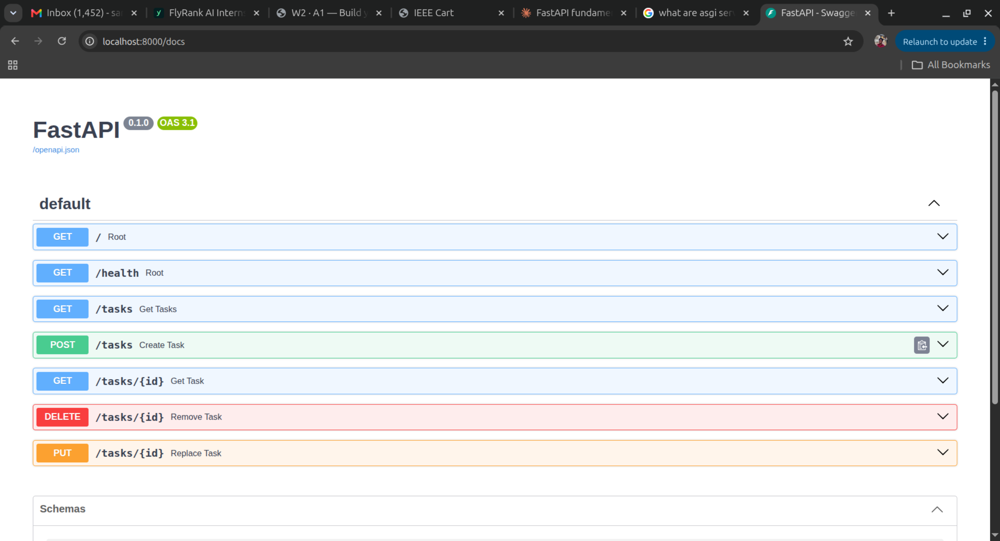

# todo-api

A basic CRUD API for a todo application, built with [FastAPI](https://fastapi.tiangolo.com/). FastAPI uses Pydantic for data validation and is built on Starlette for ASGI request handling.

The list of tasks ships with three default items, and the API lets you:

- Get all tasks
- Get a specific task by its id
- Create a task by specifying a name and completion status
- Update (replace) a task by id
- Delete a task by id

## Getting started

Clone the repository and run it locally. [uv](https://docs.astral.sh/uv/) is recommended to manage the Python environment and install dependencies into an isolated virtual environment.

Install uv (if you don't have it already):

```
pip install uv
```

Then start the dev server:

```
uv run fastapi dev main.py
```

Finally, open the following link in your browser to view the API in Swagger UI:

```
http://127.0.0.1:8000/docs
```

